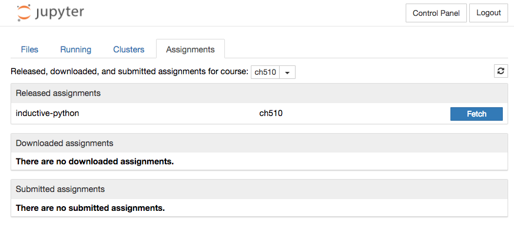
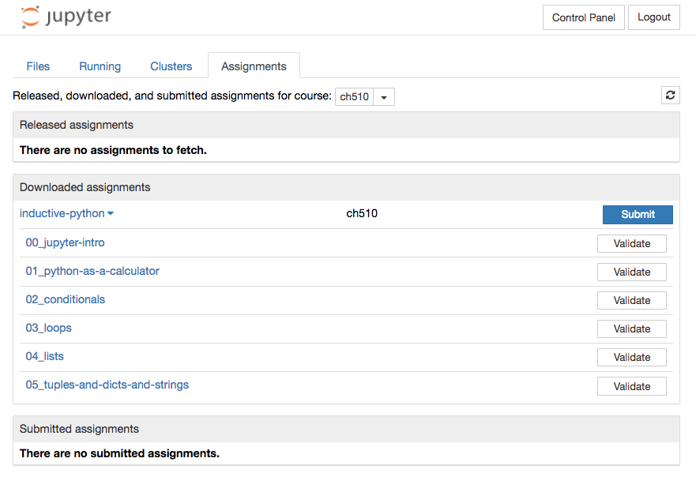
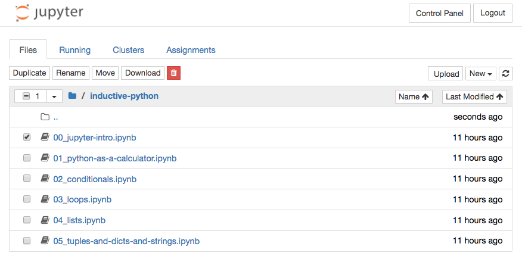
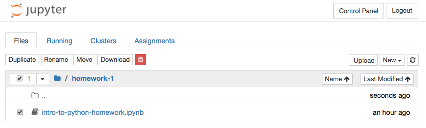
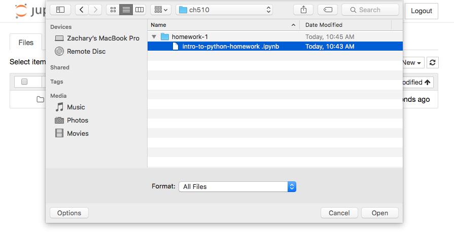
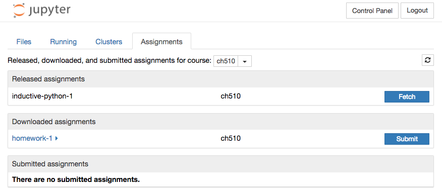
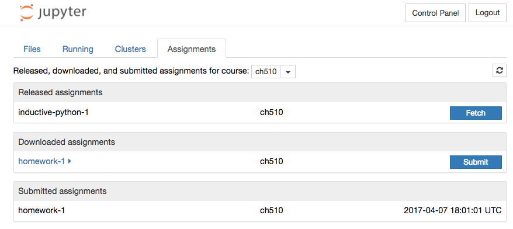

:orphan:

Jupyterhub
==========

All lecture materials and homework will be distributed through a Jupyterhub hosted
here on campus. To access these assignments, open a browser (Google Chrome, Safari,
or Firefox, not Internet Explorer) and go to:

`https://aclarke.uoregon.edu:8000 <https://aclarke.uoregon.edu:8000>`_

You may get a warning about security. Don't panic, the page is secure. If that happens,
click the "Advanced" link, and you'll get a new link that says "Process to aclark.uoregon.edu (unsafe)".
Click that link as well and you'll arrive at this page:

.. image:: img/jh-signin.png
    :align: center

Fetching assignments
--------------------

When we release a new assignment or lecture folder, you will need to *fetch* it
through the Jupyterhub. Login and you will see your personal Jupyter dashboard.

.. image:: img/jh-dashboard.png
    :align: center

At the top of the dashboard, click on the **Assignments** tab. This will display
three panels: *Released assignments*, *Downloaded Assignments*, and *Submitted
Assignments*.

The *Released assignments* panel lists lecture materials and homeworks
that are available to download. You can acquire an item from this list by clicking the **Fetch**
button. The item will move into the *Downloaded assignments*
panel.

Click on the **Files** tab at the top of the page, and you'll see the items in your
dashboard. Now you can open the items you snatched from us, but **DO NOT** run the
notebooks on the server.

.. note::

    You can always re-fetch assignments if something goes wrong. Just **Delete**
    (or rename) the bad folder from your dashboard, and it will reappear in the
    *Released Assignments* tab. You can click **Fetch** again and get a fresh copy.

Downloading assignments locally
-------------------------------

Fetching items *does not* download them to your computer. They are still on the server.
To download a notebook to your computer, check the box to the left of it and click **Download**.
Unfortunately, Jupyterhub only allows you to download a
single notebook at a time, so you'll need to do this for each notebook.

This will likely download to your *Downloads* folder on your computer. You can
move them to whatever folder you use for this class and launch Jupyter to run them.

.. note::

    Any changes you make to the notebook on your local computer won't be saved on the server.
    This is a local copy that you can freely change. If you want to start with a fresh
    copy, just re-download the notebook from JupyterHub.

Submitting Homework
-------------------

To submit a homework assignment that you've downloaded and worked on locally
(on your computer), you must upload it back to Jupyterhub and **replace** the original
file in its original location with your new file.

Login to Jupyterhub and navigate to the folder that contains the original notebook.
Check the box next to the notebook, click the trash button, and delete.

.. image:: img/jh-delete-2.png
    :align: center

Next, click **Upload** in the upper right corner of the dashboard and upload your
notebook to the server. You'll need to confirm the upload by clicking the **Upload**
button next to the notebook in the dashboard

Once the file is uploaded, click on the *Assignments* tab at the top of the dashboard.
Find the homework assignment in the *Downloaded Assignments* panel and click **Submit**.

The submitted assignment will show up in the *Submitted assignments* panel with
a timestamp printed to the right. We will collect assignments on their due date.
Any assignment not submitted through the Jupyterhub by the due date will not be
collected for grading.

.. note::

    You can submit an assignment multiple times and we will always collect
    the most recent version. No other students will
    be able to see your submissions.

